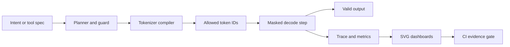

# Introduction To TROPICA

TROPICA is an evidence-first prototype for reliable structured generation.
The package name is `cdsd`, short for Control-Delta Support Decoding.

The project explores a simple but demanding claim:

```text
Models may rank choices, but external support should define what is possible.
```

In ordinary generation, a model can be nudged toward a valid answer with
prompts, examples, fine tuning, penalties, or retries. Those methods can help,
but they do not make invalid tokens impossible. TROPICA treats legality as a
runtime contract. At every token step, planners, guards, tokenizer automata, and
optional policy masks define the legal support before sampling happens.

## Who This Is For

This repository is for people building or evaluating systems that need
machine-checkable output:

- structured JSON or tool calls
- enum-constrained values under real tokenizer IDs
- grammar-like prefix validity
- planner-valid outputs, not just syntactically valid outputs
- evidence that can be re-run in CI

It is also for reviewers. A new user should be able to install the package,
run one command, and inspect a report without needing a live explanation.

## Why It Exists

Constrained decoding often gets brittle at the exact layer where correctness
matters most:

- tokenizer boundaries do not match human-readable strings
- shared prefixes introduce ambiguous partial values
- whitespace and Unicode can round-trip unexpectedly
- JSON-looking text may not satisfy a schema
- tool-call names and argument values can leak suffixes or illegal keys
- model logits can strongly prefer invalid punctuation or invalid continuations

TROPICA addresses those failure modes with external, typed mechanisms:

- strict tokenizer encode/decode checks
- token-prefix automata over real tokenizer IDs
- finite structured-output enumeration for bounded JSON/tool-call specs
- negative controls for invalid token IDs, truncation, suffix leakage, lossy
  tokenizers, collisions, unbounded schemas, and hostile logits
- CI-style thresholds that fail closed

## Core Idea

The project separates awareness from authority.

```text
Internalize awareness. Externalize authority.
```

A model or recurrent control lane may learn planner and guard state. That can
improve ranking inside legal support. But legality is enforced externally:

```text
final_mask_t = plan_mask_t & guard_mask_t & policy_mask_t
```

Tokens outside `final_mask_t` receive negative infinity before sampling. They
are not merely discouraged. They are unrepresentable.

## Mental Model



Interpretation: TROPICA turns output validity into a step-by-step support
contract, then records whether that contract survives realistic edge cases.

## Methodology

TROPICA combines five layers.

1. Planners define semantic feasibility.

   A planner can expose all optimal next moves, not just one preferred move.
   This preserves diversity while keeping generation on a valid frontier.

2. Guards enforce prefix legality.

   A guard checks whether the partial output remains valid as it streams. This
   catches problems before the output is complete.

3. Tokenizer compilers translate literals into real token-ID masks.

   Enum literals are compiled through real tokenizer adapters such as
   `tiktoken/cl100k_base` and locally constructed Hugging Face tokenizers. The
   compiler rejects empty encodes, lossy round trips, duplicate literals, and
   token-sequence collisions.

4. Structured-output compilers enumerate bounded JSON/tool-call specs.

   TROPICA supports a finite JSON Schema subset: objects with ordered
   properties, required fields, `additionalProperties=false`, enum-valued
   strings/numbers/booleans/null, and small bounded arrays. Unbounded schemas
   are rejected by design.

5. Evidence gates make the claim reproducible.

   The report runner executes tests, harnesses, visuals, and thresholds. It
   writes both human-readable and machine-readable artifacts.

## What The Evidence Suite Proves

Run:

```bash
cdsd-report --with-pytest --artifacts artifacts --jobs 4
```

The command writes:

- `artifacts/report_index.md`
- `artifacts/report_manifest.json`
- `artifacts/*_summary.csv`
- `artifacts/*_summary.md`
- `artifacts/*_visuals.svg`

The dashboards cover six surfaces.

| Surface | What It Shows | What Passing Means |
| --- | --- | --- |
| Experiment | Ablations across raw generation, grammar-only, planner-guided, ControlDelta-only, and ControlDelta plus external support | External support is the authority; internal awareness alone is not enough |
| Tokenizer correctness | Real tokenizer exact generation and negative controls | Literal masks survive Unicode, whitespace, shared prefixes, invalid IDs, truncation, and suffix attacks |
| Structured output | Bounded JSON/tool-call compilation and hostile decode | Real token masks can constrain generation to exact valid tool calls |
| Model integration | Offline provider-driven decode loops and trace events | Model adapters can rank legal and illegal IDs while the decoder selects only legal support |
| Stress | Adversarial and randomized cases across planners, guards, workflows, tokenizer automata, and ControlDelta numerics | The core contracts survive thousands of cases |
| Scale | Larger horizons, enum counts, workflow graphs, and ControlDelta sequence sizes | Correctness remains intact as problem size increases |

If `report_manifest.json` says `"passed": true`, the full evidence gate passed.
If it says false, inspect the failed gate names and the corresponding summary
CSV.

## Install And First Run

From a fresh source checkout:

```bash
python -m pip install -e ".[real-tokenizers,dev]"
cdsd-report --with-pytest --artifacts artifacts --jobs 4
```

For a wheel smoke test:

```bash
python -m build
python -m pip install --force-reinstall "dist/control_delta_support_decoding-0.1.0-py3-none-any.whl[real-tokenizers]"
mkdir ../cdsd-wheel-smoke
cd ../cdsd-wheel-smoke
cdsd-report --artifacts smoke_artifacts --jobs 4
```

Use `--with-pytest` only from a checkout that contains `tests/`.
Use `--jobs 1` when you want serial logs, or a larger value for faster parallel
report tracks.

For browser-first evaluation, use the Colab pack:

- `notebooks/01_operator_onboarding.ipynb`
- `notebooks/02_benchmark_suite.ipynb`
- `notebooks/03_researcher_showcase.ipynb`

See `docs/COLAB.md` for direct Colab links and the runtime contract.

## Minimal API Example

```python
from cdsd import HostileLogitProvider, StructuredOutputCompiler, StructuredOutputDecoder, TiktokenAdapter, ToolCallSpec

spec = ToolCallSpec(
    "search",
    {
        "type": "object",
        "required": ["query", "limit"],
        "properties": {
            "query": {"type": "string", "enum": ["alpha", "beta"]},
            "limit": {"type": "integer", "enum": [1, 3]},
        },
        "additionalProperties": False,
    },
)

compiler = StructuredOutputCompiler(TiktokenAdapter("cl100k_base"), [spec])
result = StructuredOutputDecoder(compiler).decode(HostileLogitProvider(), max_steps=256)

print(result.value)
print(result.parsed)
```

In a real model loop, implement `LogitProvider` so your adapter scores candidate
tokens. The decoder samples or selects only from `allowed_token_ids(state)` and
records trace events.

## Project Map

- `src/cdsd/decoder.py`: support-contract decode loop
- `src/cdsd/masks.py`: mask utilities and safety checks
- `src/cdsd/tokenizer_compiler.py`: tokenizer adapters and token-prefix automata
- `src/cdsd/structured_output.py`: bounded JSON/tool-call compiler
- `src/cdsd/model_integration.py`: offline provider-driven structured decoder
- `src/cdsd/planners/`: exact planners for demo domains
- `src/cdsd/guards/`: streaming guards
- `src/cdsd/evidence/runner.py`: importable evidence orchestration
- `demos/`: compatibility wrappers and report harnesses
- `tests/`: unit, negative-control, reporting, and packaging checks
- `docs/`: installation, architecture, metrics, and API quickstarts
- `notebooks/`: Colab operator, benchmark, and researcher workflows

## Current Status

TROPICA is a credible prototype, not a complete structured-output platform.

What is solid today:

- installable package and wheel
- public `cdsd-report` command
- real tokenizer adapters
- strict tokenizer round-trip validation
- bounded structured-output compiler
- offline model-integration decoder and trace events
- deterministic hostile-logit decode tests
- report dashboards and CI gates
- Colab notebooks for onboarding, benchmark evidence, and researcher demos

What is intentionally limited:

- only a finite JSON Schema subset is supported
- unbounded strings and unrestricted numbers are rejected
- hosted model integration remains out of scope; the current SDK is offline and adapter-oriented
- the evidence suite focuses on correctness contracts, not application quality

## Future Direction

The next useful milestones are:

- richer bounded schema support without weakening fail-closed behavior
- production model adapters for local and hosted inference loops
- larger benchmark suites for latency and memory scaling
- trace viewers for token-by-token mask decisions
- package signing and release automation
- integration examples for tool routers, workflow agents, and CI review bots
- clearer formal contracts for planner/guard composition

The guiding constraint should stay the same: every new capability must come
with negative controls, visuals, and a report gate that can fail in CI.

## Reading Path

Start here, then continue in this order:

1. `docs/INSTALL.md`
2. `docs/API_QUICKSTART.md`
3. `docs/MODEL_INTEGRATION.md`
4. `docs/COLAB.md`
5. `docs/REPORTING.md`
6. `docs/ARCHITECTURE.md`
7. `docs/METRICS.md`
8. `artifacts/report_index.md` after running `cdsd-report`
